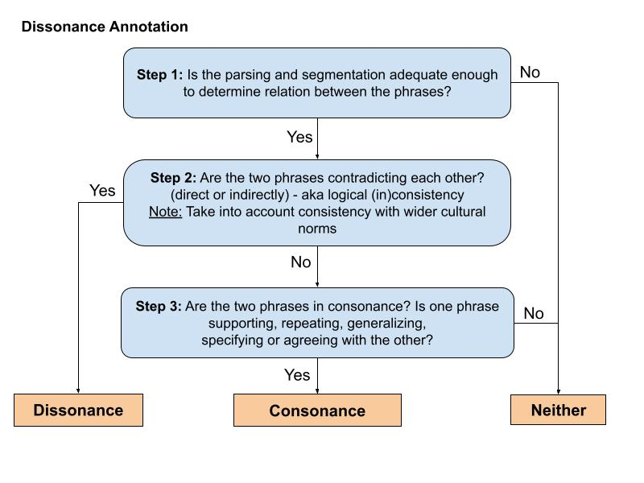

# Dissonance Twitter Dataset
Dataset collected from annotating tweets for within-person dissonance, as described in our paper [Transfer and Active Learning for Dissonance Detection: Addressing the Rare Class Challenge](https://arxiv.org/abs/2305.02459). 

## Annotation details

The annotations were conducted on a sheet in the following **dissonance-first** format. 


The annotators used the following flowchart as a more detailed guide to determining the Dissonance, Consonance and Neither/Other classes: 


Tweets were parsed into discourse units, and marked as Belief (Thought or Action) or Other, and pairs of beliefs within the same tweet were relayed to annotators for Dissonance annotation.


## Data Organization

In the folder `./data/`, you can find the following files containing the data:

* `train_small.json`: Small train set as described in Section 4.4 of the paper, containing 2924 examples (6.29% dissonance)
* `train_big.json`: Big train set as described in Section 4.4 of the paper, containing 6649 examples (10.40% dissonance)
* `dev.json`: The final development set as described in Section 3.1, containing 1484 examples (10.24% dissonance)
* `test.json`: The final test set as described in Section 3.1, containing 1456 examples (10.30% dissonance)


## Data Format

* Each example has a unique `id`.
* The `message` contains the entire message so that it provides the context of the Belief units.
* The two belief discourse units are recorded for each message in the fields `du1` and `du2` respectively.
* The discourse units in a `message` are marked using angled brackets "<" and ">".
* Each example is classified with a `label` of "C" (Consonance), "D" (Dissonance) and "N" (Neither/Other).

## Reading the data
If you would like to use the data in a dictionary by directly reading from the json files:
```
import json
train_dataset = json.load("data/train_big.json")
```

If you prefer dataframes, you could use Python>=3.8 for the following version of pandas to be installed in order to load the dataset:
```
pip install pandas==1.4.1
```

Load the dataset using the following code snippet:
```
import json
import pandas as pd
with open('data/train_big.json', 'r') as f:
    train_dataset = json.load(f)
df = pd.DataFrame(data)
```


